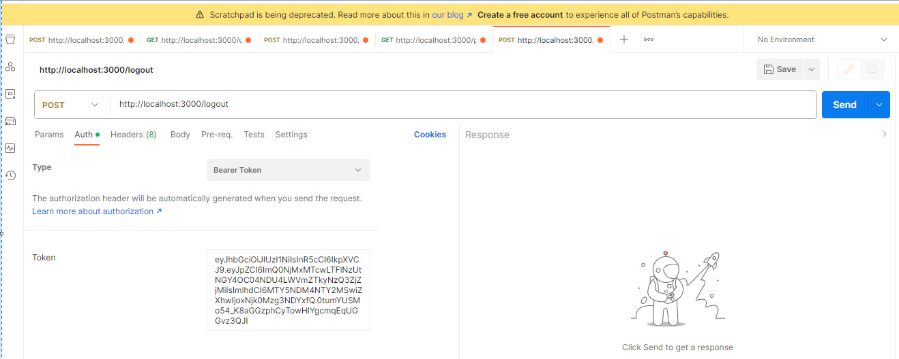

## <em> MODULO DE LOGIN: ARQUITECTURA HEXAGONAL, DDD, MONGODB Y EXPRESS </em>
☑️ Proyecto Terminado ☑️

Este repositorio levanta un servidor backend de NodeJs para un modulo de Login. Utiliando Express y MongoDB. Todo esto aplicando buenas practicas con Arquitectura Hexagonal y DDD.

## 📔 Funcionalidades

- `Registrar Usuario`: Permite registrar un usuario de acuerdo a las siguientes reglas de negocio: 
    - El correo debe ser un correo valido (debe terminar en @___.com).
    - La clave debe contener mayúsculas, signos especiales, números y mínimo 8 caracteres (Ejem: Clavenueva1.).
    - El correo y el nombre de usuario son únicos.
- `Ver Lista de Usuarios`: Se podrá acceder a la lista de usuarios con paginación. No hace falta estar autorizado.
- `Login de Usuario`: El usuario podrá iniciar sesión son su nombre de usuario y contraseña. Este servicio devolverá un JWT al iniciar sesión. En caso de volver a llamar el servicio sin hacer Logout, este devolverá el JWT de la última sesión activa en caso de que se haya perdido el token.
- `Ver perfil del usuario`: El usuario podrá ver sus datos de perfil siempre y cuando tenga una sesión iniciada y esté autorizado.
- `Logout de Usuario`: El usuario podrá cerrar la sesión si está autorizado.

## 🛠️ Cómo correr el proyecto

Clonar el reposiorio:
```bash
git clone  https://github.com/jerojash/Login-module.git
```
Luego muevete a la carpeta y configura las variables de entorno:
```bash
Copia y pega el archivo .env.example.
A la copia, elimina la extension .example de modo que el nombre del archivo quede: '.env'.
Configura las variables de acuerdo a tu entorno de desarrollo.
```
### ❗❗ Nota importante. ❗❗
###### Para efectos de este proyecto tambien se dejarán las variables de entorno usadas en el desarrollo del proyecto en el archivo .env.example. Esto en caso de que no cuenten con una base de datos MongoDB en local. Así que tendrán acceso al cluster en MongoDB Atlas.

 Descarga las dependencias:
```bash
npm install
```
 Generar la carpeta dist:
```bash
npm run build
```
Correr el proyecto:
```bash
npm run start
```


## 🛠️ Rutas y Bodys
#### POST /register
```bash
{
  "username": "string",
  "password": "string",
  "firstName": "string",
  "lastName": "string",
  "email": "string@gmail.com"
}
```
#### GET /users?page=number&limit=number
#### POST /login
```bash
{
    "username": "string",
    "password": "string"
}
```
#### POST /logout
```bash
En este caso el usuario debe estar autorizado con el token proporcionado en el Login.
```



#### GET /profile
```bash
Al igual que el servicio de LOGOUT, el usuario debe estar autorizado con el token proporcionado en el Login.
```

